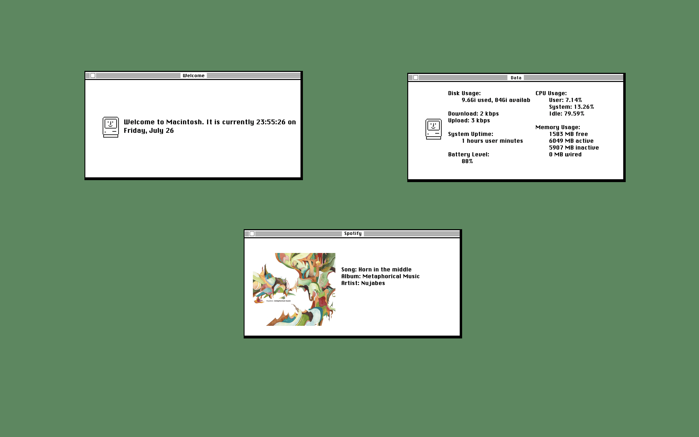

# Retro-Macintosh-Geektool-Setup

This project is inspired by and based on work by [Jayylmao](https://github.com/jayylmao) from the original repository [Retro-Macintosh-Geektool-Setup](https://github.com/jayylmao/Retro-Macintosh-Geektool-Setup). The original repository provided the initial AppleScript files for the time and Spotify widgets.

## Screenshot

## Modifications and Additions
- New script for displaying system monitoring data
- Light modifications to the `time.scpt` file for improved compatibility (and only military time)

## To Do
- Layout for the data widget
- Weather thing

## Images Used
- [Welcome.png](https://github.com/jayylmao/Retro-Macintosh-Geektool-Setup/blob/master/Widget%20Frames/Welcome.png)
- [Spotify.png](https://github.com/jayylmao/Retro-Macintosh-Geektool-Setup/blob/master/Widget%20Frames/Spotify.png)

## Setup
1. Clone the repo locally.
2. Open GeekTool and place the frames on your desktop as image Geeklets.
3. To set up the greeter widget, place a shell Geeklet and point it to the `time.scpt` file.
4. To set up the Spotify widget, place an image Geeklet and name it "albumArt". Then, place a shell Geeklet and point it to the `spotifyControl.applescript` file.
5. To set up the data widget, place two shell Geeklets and point the first one to the `datapt1.scpt` file and the other one to the `datapt2.scpt` file.
